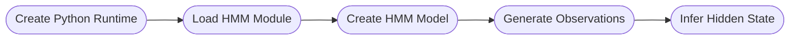

# Getting Started

The workflow starts with creating a python runtime, followed by loading the ssm package, referred to as the HMM module. After this, you can instantiate the HMM model and pass it observations of data to perform inference. Since this package relies on communication between Bonsai and Python, the observations that the model uses must be formatted into a valid string representation of a Python data type, namely a list of numbers.

## Workflow

> [!NOTE]
> Due to the way Bonsai.ML interacts with Python, it is necessary for the first two steps to complete before instantiating the model. It is important to know that the initialization of the Python runtime, loading the module, and creating the model takes time to complete, and that only once the model has been created can inference be performed.

## Implementation

Below is a simplified Bonsai workflow that implements the core logic of the package.

:::workflow

:::

A `CreateRuntime` node is used to initialize a python runtime engine, which gets passed to a `BehaviorSubject` called `PythonEngine`. Bonsai's `CreateRuntime` node should automatically detect the python virtual environment if it was activated in the same terminal that was used to launch Bonsai, otherwise the path to the virtual environment can be specified in the `CreateRuntime` node by setting the `PythonHome` property.

Next, the `PythonEngine` node is passed to a `LoadHMMModule` node which will load the ssm package into the python environment.

Once the HMM module has been initialized, the `CreateHMMModel` node instantiates a python instance of the HMM model. Here, you can specify the initialization parameters of the model and provide a `ModelName` parameter that gets used to reference the model in other parts of the Bonsai workflow.

It is crucial that the `Data` are formatted into a string that the model can use, namely a string representing a Python list. For example, if you pass a Tuple with 2 items as your data, then the formatter should look something like `"[" + Item1.ToString() + Item2.ToString() + "]"`. The output of this should be used as your observations into the model, so connect your data source to a `Subject` named `Data` and modify the `FormatToPython` node to fit with your data.

`Observations` are then passed to an `InferState` node, which will use the specified model (given by the `ModelName` property) to infer the latent state of the model and outputs the `StateProbabilities`, or probabilities of being in each state given the observation.

### Further Examples

For further examples and demonstrations for how this package works, see the [Bonsai - Machine Learning Examples](~/examples/README.md) section.
