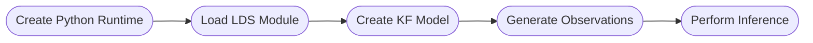

# Getting Started

This guide shows you how to use the environments created in the previous installation steps to run the package. Depending on your operating system, follow the [activating environments in Windows](#activating-environments---windows) or [activating environments in Linux](#activating-environments---linux) instructions below.

> [!WARNING]
> These environments are not configured to run the example workflows. To run the examples, you must install the necessary packages or follow the [Examples](~/examples/README.md) getting started guide to bootstrap the environments directly from the repo provided.

### Activating environments - Windows

Activate the python environment and launch the Bonsai.exe inside the bonsai environment folder using the following:

```cmd
.venv\Scripts\activate
.bonsai\Bonsai.exe
```

### Activating environments - Linux

If you used the Linux environment creation tool, you can activate you bonsai environment the same as you would activate your python virtual environment. You can have both the python and the bonsai environments activated at the same time.

> [!WARNING]
> The order of activating the environments matters so you must activate the python environment first and the bonsai environment second.

```cmd
source .venv/bin/activate
source .bonsai/activate
bonsai
```

If you did not use the linux environment template but you plan on using linux, you can simply activate the python environment and then run the bonsai application in the folder using `mono`.

```cmd
source .venv/bin/activate
mono .bonsai/Bonsai.exe
```

### General workflow

The workflow starts with creating a python runtime, followed by loading the [lds_python](https://github.com/joacorapela/lds_python) module. After this, you can instantiate the model and pass it observations of data to perform inference.



> [!NOTE]
> Due to the way Bonsai.ML interacts with Python, it is necessary for the first two steps to complete before instantiating the model. It is important to know that the initialization of the Python runtime, loading the module, and creating the model takes time to complete, and that only once the model has been created can inference be performed.

### Implementing in Bonsai

Below is a simplified Bonsai workflow that implements the core logic of the package.

:::workflow

:::

A `CreateRuntime` node is used to initialize a python runtime engine, which gets passed to a `BehaviorSubject` called `PythonEngine`. Bonsai's `CreateRuntime` node should automatically detect the python virtual environment that was used to launch the Bonsai application, otherwise the path to the virtual environment can be specified in the `CreateRuntime` node by setting the `PythonHome` property.

Next, the `PythonEngine` node is passed to a `LoadLDSModule` node which will load the lds_python package into the python environment.

Once the LDS module has been initialized, the `CreateKFModel` node instantiates a python instance of the Kalman Filter Kinematics model. Here, you can specify the initialization parameters of the model and provide a `ModelName` parameter that gets used to reference the model in other parts of the Bonsai workflow.

Next, you would take some tracking data (for example, the centroid of an animal or a 2D point), and pass that to a `CreateObservation2D` node which will package the data into a data format that the model can use.

The `Observation` is then passed to a `PerformInference` node, which will use the specified model (given by the `ModelName` property) to infer the state and output the inferred kinematics.

The only thing left to do is pass your behavior data into the `BehaviorData` subject. To do this, simply connect the output of your 2D data to a `Subject` named `BehaviorData` and the model will start converting this data into observations which it can then us to perform inference.

### Setting model parameters

The `CreateKFModel` node contains a number of properties which can be useful to determine the model dynamics. 

### Further Examples

For further examples and demonstrations for how this package works, see the [Bonsai - Machine Learning Examples](~/examples/README.md) section.
