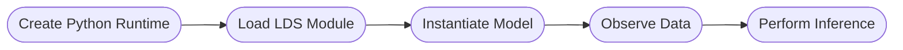

# Getting Started

Depending on your operating system, follow the [activating environments in Windows](#activating-environments---windows) or [activating environments in Linux](#activating-environments---linux) instructions below.

### Activating environments - Windows

Activate the python environment and launch the Bonsai.exe inside the bonsai environment folder using the following:

```cmd
.venv\Scripts\activate
.bonsai\Bonsai.exe
```

### Activating environments - Linux

If you used the Linux environment creation tool, you can activate you bonsai environment the same as you would activate your python virtual environment. You can have both the python and the bonsai environments activated at the same time. *Note* that the order of activating the environments matters so you must activate the python environment first and then the bonsai environment second.

```cmd
source .venv/bin/activate
source .bonsai/activate
```

If you did not use the linux environment template but you plan on using linux, you can simply activate the python environment and then run the bonsai application in the folder using `mono`.

```cmd
source .venv/bin/activate
mono .bonsai/Bonsai.exe
```

### General workflow

The workflow starts with creating a python runtime, followed by loading the [lds_python](https://github.com/joacorapela/lds_python) module. After this, you can instantiate the model and pass it observations of data to perform inference.



### Implementing in Bonsai

Below is a simplified Bonsai workflow that implements the core logic of the package.

:::workflow

:::

A `CreateRuntime` node is used to initialize a python runtime engine, which gets passed to a `BehaviorSubject` called `PythonEngine`. Bonsai's `CreateRuntime` node should automatically detect the python virtual environment that was used to launch the Bonsai application, otherwise the path to the virtual environment can be specified in the `CreateRuntime` node by setting the `PythonHome` property.

Next, the `PythonEngine` node is passed to a `LoadLDSModule` node which will load the lds_python package into the python environment.

Once the LDS module has been initialized, the `CreateKalmanFilterKinematicsModel` node instantiates a python instance of the Kalman Filter Kinematics model. Here, you can specify the initialization parameters of the model and provide a `ModelName` parameter that gets used to reference the model in other parts of the Bonsai workflow.

Next, you would take some tracking data (for example, the centroid of an animal or a 2D point), and pass that to a `CreateObservation2D` node which will package the data into a data format that the model can use.

The `Observation` is then passed to a `PerformInference` node, which will use the specified model (given by the ModelName) to infer the state of model and output the inferred behavioural kinematics.

Then, all you have to do is pass your behavior data of interest into the `BehaviorData` subject and the model will start performing inference.

### Further Examples

For examples and demonstrations for how this works, see the [Bonsai - Machine Learning Examples](../../../examples/README.md) section.
