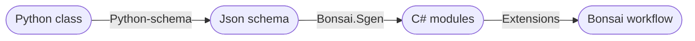
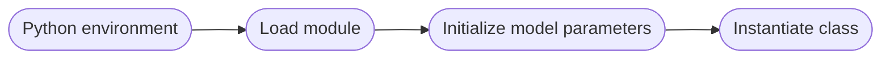
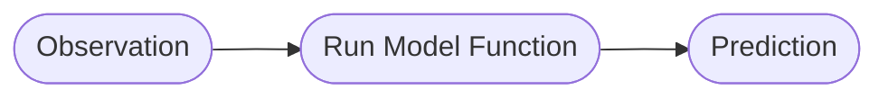

# Flowchart to convert python class to functional bonsai code

The following represents the general pipeline for converting a machine learning model into a usable bonsai model.

Generic types of schemas:

1. Model schema -> used for initializing parameters of model using external data or data defined in bonsai
   - Could also be used to access internal parameters of the model
2. Observation schema -> used for converting observations of data in bonsai into correct inputs in python
3. Prediction schema -> used for converting outputs from python into usable data structures in Bonsai

### General workflow

Once the schemas are generated from Python and the C# modules are generated from the schemas, the following represents a general pipeline for using these modules in Bonsai.

Once your python class is initialized with the correct model parameters, you can then send observations of data to one of the models functions and generate predictions

